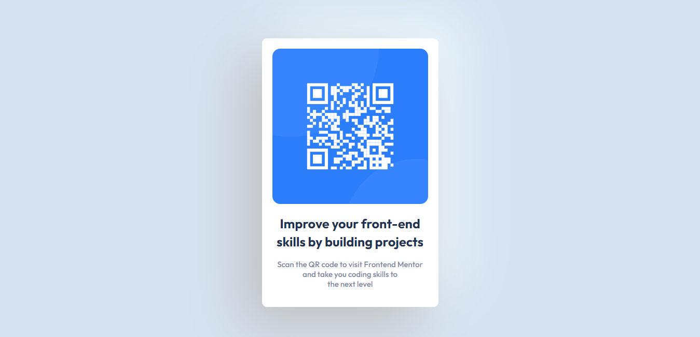

# Frontend Mentor - QR code component solution

This is a solution to the [QR code component challenge on Frontend Mentor](https://www.frontendmentor.io/challenges/qr-code-component-iux_sIO_H). Frontend Mentor challenges help you improve your coding skills by building realistic projects. 

## Table of contents

- [Frontend Mentor - QR code component solution](#frontend-mentor---qr-code-component-solution)
  - [Table of contents](#table-of-contents)
  - [Overview](#overview)
    - [Screenshot](#screenshot)
    - [Links](#links)
  - [My process](#my-process)
    - [Built with](#built-with)
    - [Useful resources](#useful-resources)
  - [Author](#author)
  - [Acknowledgments](#acknowledgments)

## Overview

### Screenshot

### Links

- Solution URL: [github](https://github.com/Sayidcali-kp/qr-code-component)
- Live Site URL: [qr-component-design]()

## My process

### Built with

- Semantic HTML5 markup
- Flexbox
- Mobile-first workflow

### Useful resources

- [Flexbox sheet](https://flexboxsheet.com/) - A simple flexbox cheatsheet.

## Author

- Website - [Sayidcali-kp](https://github.com/Sayidcali-kp)
- Frontend Mentor - [@Sayidcali-kp](https://www.frontendmentor.io/profile/Sayidcali-kp)

## Acknowledgments

A big thank you to anyone providing feedback on my solution. It definitely helps to find new ways to code and find easier solutions!
